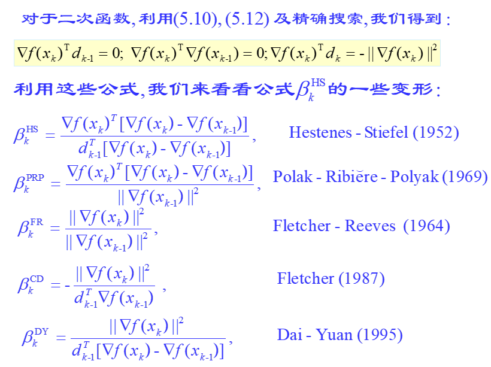

本节从共轭梯度法到HS算法、FR算法等。

# 共轭梯度法续

算法的过程

> 首先取$d_0=-\nabla f(x_0)$
>
> 后续迭代中，取负梯度与前一搜索方向的线性组合作为方向。$$d_k=-\nabla f(x_k)+\beta_kd_{k-1} $$，其中$\beta_k$是待定系数。
>
> $$x_{k+1}=x_k+\alpha_kd_k $$
>
> 由于$\alpha_k$是精确搜索得到，因此$$\nabla f(x_{k+1})^Td_k=0 $$
>
> 令$d_{k-1}^TQd_k=0 $，因此有$$\beta_k=\frac{d_{k-1}^TQ\nabla f(x_k)}{d_{k-1}^TQd_{k-1}} $$
>
> 本质上，其下降方向就是当前以及以前梯度的线性组合，并且确保当前梯度的系数为$1$.

# HS共轭梯度法

为了避免存储黑塞矩阵，需要得到$Qd_{k-1}$的表达式。

对于二次函数(或者近似看成二次函数)，由于$$\nabla f(x_k)=\nabla f(x_{k-1})+\alpha_{k-1}Qd_{k-1} $$，可以推出$$Q d_{k-1}=\frac{\nabla f(x_k)-\nabla f(x_{k-1})}{\alpha_{k-1}} $$

代入整理有$$\beta_k^{HS}=\frac{\nabla f(x_k)^T[\nabla f(x_k)-\nabla f(x_{k-1})]}{d_{k-1}^T[\nabla f(x_k)-\nabla f(x_{k-1})]} $$

## 共轭梯度法的性质与证明

> HS算法关于**严格凸二次函数**的共轭性质：
>
> 设$\{x_k \}$表示采用精确搜索得到的HS算法求解问题缩产生的点列，则向量组$\{d_i \} $关于黑塞矩阵$Q$相互共轭，而且有$$\nabla f(x_k)^Td_j=0,\quad \nabla f(x_k)^T\nabla f(x_j)=0,\quad \forall j<k $$
>
> 这就是共轭梯度法的一个最本质的定理。
>
> 这表明，这样的方法对于严格凸二次函数满足：
> 1. **下降方向关于黑塞矩阵共轭**
> 2. **当前梯度关于以往下降方向正交**
> 3. **当前梯度关于以往梯度正交**
>
> 该定理使用数学归纳法来证明。
>
> 证明：
>
> $k=1$时：
>
> 首先，算法的定义直接保证了跟上一步的共轭关系。因此$k=1$时共轭关系满足。
>
> 精确搜索保证了$$\nabla f(x_1)^Td_0=-\nabla f(x_1)^T\nabla f(x_0)=0,\quad \forall j<k $$
>
> 下面证明当对某个$k-1$成立时，对$k$也成立。
>
> 先证梯度与下降方向的遗传正交
>
> $$d_j^T\nabla f(x_{k})=d_j^T\{\nabla f(x_{j+1}) +\sum_{l=j+1}^{k-1}[\nabla f(x_{l+1})-\nabla f(x_l)] \} =\sum_{l=j+1}^{k-1}\alpha_ld_j^TQd_l=0 $$
>
> 再证梯度与梯度的遗传正交
>
> $$\nabla f(x_k)^T\nabla f(x_j)=\nabla f(x_k)^T(\beta_{j}d_{j-1}-d_{j})=0 $$
>
> 最后证下降方向的共轭
>
> $$d_{k}^TQd_j=\beta_{k}d_{k-1}^TQd_j-\nabla f(x_{k})^TQd_j= -\nabla f(x_{k})^T\alpha_j^{-1}(\nabla f(x_{j+1})-\nabla f(x_j))=0 $$
>
> 归纳就证毕。
>
> 这里的证明中需要学习到的是：
> 1. 利用归纳法证明遗传性质
> 2. 利用展开构造差的求和来应用假设满足的性质
>
> 类似的证明后面应该很常见，这个证明过程需要掌握。

## 其他共轭梯度法

下面可以看到一些其他的共轭梯度法。

> 需要掌握的算法：
>
> HS算法
> FR算法

这些共轭梯度法，其实基本上就是应用性质$$\nabla f(x_k)^Td_{k-1}=0,\nabla f(x_k)^T\nabla f(x_{k-1})=0,\nabla f(x_k)^Td_k=-\Vert \nabla f(x_k)\Vert^2 $$来对HS算法的变形。这些性质实际上也是上一个定理给出或推出的。

## 共轭梯度法的收敛性

> 共轭梯度法的进一步收敛性
>
> **定理**：在精确搜索下，使用共轭梯度法求解凸二次函数的极小化问题时具有如下性质：
> 1. 算法产生的方向$d_0,d_1,\dots, d_{n-1}$关于矩阵$Q$相互共轭
> 2. 若矩阵$Q$有$r$个不同的特征值，则算法至多$r$次迭代即收敛到最优解
> 3. 设$Q$的最大最小特征值之比为$\kappa=\frac{\lambda_{\max}}{\lambda_{\min}}$，那么就有$$\Vert x_k-x^*\Vert_Q\leq 2(\frac{\sqrt{\kappa}-1}{\sqrt{\kappa}+1})^k\Vert x_0-x^*\Vert_Q $$，其中$\Vert x\Vert_Q=(x^TQx)^{\frac{1}{2}} $
>
> 证明不重要。

## 对于非二次函数的收敛性

对非二次函数，其收敛很复杂。

可以看[ppt](../ppt/最优化第14讲%20%20%20共轭梯度法(续).ppt)查看FR方法与PRP方法的收敛性证明。

这里一般会给出这些假设

> 1. 水平集$\Omega=\{x\in R^n|f(x)\leq f(x_0) \} $有界
> 2. 存在$\Omega$的某个邻域$N$，使得$f$在邻域内连续可微，且梯度$\nabla f(x)$满足Lipschitz条件。

> 定理
>
> 若上面的假设成立，那么采用精确搜索的FR算法产生的点列直接满足$$\lim_{k\to\infty} \inf\Vert \nabla f(x_k)\Vert=0 $$

> 定理
>
> 若上面的假设成立，且采用借确搜索产生的点列还满足$$x_{k+1}-x_k\to0 $$，那么就有$$\lim_{k\to\infty} \inf\Vert \nabla f(x_k)\Vert=0 $$

这样看，PRP收敛的要求比FP要强，但是当$f(x)$一致凸，那么要求就减弱到一致

> 定理
>
> 若上面的假设成立，且$f$一致凸，则采用精确搜索的PRP算法产生的点列$x_k$直接满足$$\lim_{k\to\infty} \inf\Vert \nabla f(x_k)\Vert=0 $$

另外还考虑非精确搜索

> 对非精确搜索，令$\sigma_2<\frac{1}{2}$，则FR算法产生的点列满足$$\lim_{k\to\infty} \inf\Vert \nabla f(x_k)\Vert=0 $$

为了保证共轭梯度法在较弱搜索下的收敛性，还有一些修正形式被提出。例如修正FR算法。

其实还可以考虑的方法是，$n+1$次迭代后重新开始，以$x_{n+1}$作为初始点。
