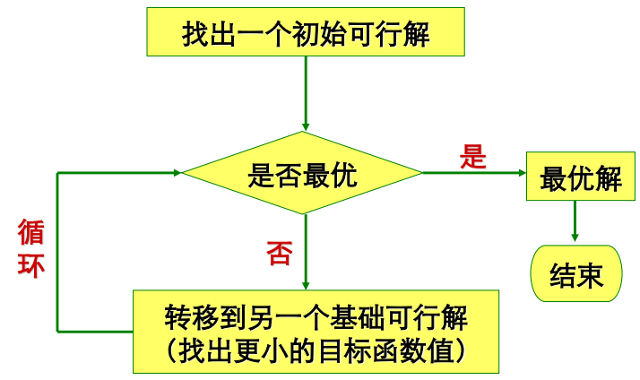
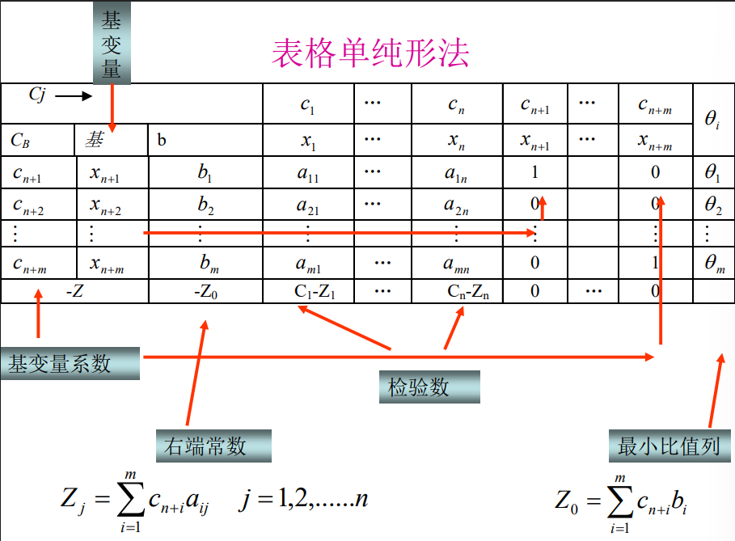

# 以前条件的总结

拉格朗日函数$$\mathcal{L}(x,\lambda,\mu)=f(x)-\sum_{i\in I(x)}\lambda_ig_i(x)-\sum_{j\in R}\mu_jh_j(x) $$

> 必要条件：
>
> 若$x$为最优解，则
> 
> 在**ACQ约束品性满足时**(LFD=SFD)(不满足则可能KKT无解)
>
> $\exist \lambda,\mu$满足KKT条件
> 
> - $$\nabla_x \mathcal{L}(x,\lambda,\mu)=0 $$
> - $$h_j(x)=0,j\in E $$
> - $$\lambda_i\geq 0,g_i(x)\geq 0,\lambda_ig_i=0,i\in I(x) $$
>
> 若满足KKT条件，且有
> - $f $凸，$g$凹，$h$线性
>
> 那么$x$为全局最优解

> 二阶必要：
> $x$为最优，若满足LICQ，则
> - KKT成立
> - $$\forall d\in S(z),d^T\nabla_x^2\mathcal{L}(x,\lambda,\mu)d\geq 0 $$
>
> 二阶充分：
> 二阶成立时，
> - 若$S(z)=\{0\} $，那么$x$为严格局部最小点
> - 若$$d^T\nabla_x^2\mathcal{L}(x,\lambda,\mu)d>0,\quad\forall 0\neq d\in S(z) $$则$x$严格局部最小
>

# 对偶问题

原问题可以改写为$$\min_x\max_{\lambda\geq 0,\mu}\mathcal{L}(x,\lambda,\mu)=f(x)-\sum_{i\in I(x)}\lambda_ig_i(x)-\sum_{j\in E}\mu_jh_j(x) $$，约束$$g_i(x)\geq 0,i\in I(x) $$$$h_j(x)=0,j\in E $$

容易证明在此约束情况下问题等价于$$\min_x f(x)$$。此处$\mu$任取是由约束$h=0$保证的。

该问题可以有**对偶问题**$$\max_{\lambda\geq 0,\mu}\min_x L(x,\lambda,\mu) $$

容易证明，$$ \min_x\max_{\lambda\geq 0,\mu}L(x,\lambda,\mu)\geq \max_{\lambda\geq 0,\mu}\min_x L(x,\lambda,\mu) $$，即原问题目标值大于对偶问题目标值。仅有该条件时称为**弱对偶问题**

若满足$$ \min_x\max_{\lambda\geq 0,\mu}L(x,\lambda,\mu)= \max_{\lambda\geq 0,\mu}\min_x L(x,\lambda,\mu) $$，即两个约束问题相等，那么称为**强对偶问题**

可以证明，当ACQ条件成立时，强对偶的条件成立。

---

对于最优解$$\min_{x\in D}f(x)  $$

有必要条件$$\nabla f(x^*)^T(x-x^*)\geq 0 $$，即变分不等式

若$D$为一个锥，那么变分不等式等价于$$\nabla f(x^*)\in D^* ,x^*\in D,\nabla f(x^*)^Tx^*=0 $$，这里就是互补问题。

其中$D^*$为$D$的共轭，即$$D^*=\{y|y^Tx\geq 0,\forall x\in D \} $$

特别地，取$D=R_+^n$，就是一个锥。那么有$D^*=D$

现在考虑问题$$\min_{\lambda\in R_+^n} -L(x,\lambda,\mu) $$，那么其对应变分不等式$$g(x^*)(x-x^*)\geq 0 $$

最后的互补问题能够推出KKT的条件$$\lambda_ig_i(x)=0 $$

---

最后可以发现，KKT条件就是对偶问题与互补问题二者的混合。

# 线性规划

## 线性规划的对偶

原问题$$\min c^Tx,\quad \text{s.t.}Ax\geq b,x\geq 0 $$

对偶问题$$\max b^Ty\quad \text{s.t.} A^Ty\leq c,y\geq 0  $$

可以证明是**强对偶**，也就是说，线性规划问题与其对偶问题的最优解是一致的。

> 对偶问题的对偶问题是原问题。

## 线性规划的标准形式

$$\min z=c^Tx$$$$ \begin{equation}
    \nonumber
    \left\{
        \begin{split}
            Ax= b\\
            x\geq 0
        \end{split}
    \right.
\end{equation} $$

1. 目标最小
2. 约束等式
3. 变量非负
4. 右端非负

### 转换为标准形式

1. 原问题求极大值，则目标函数乘-1
2. 存在不等式约束，由$$ \sum a_{ij}\leq b_i $$变为$$ \sum a_{ij}x_j+x_{n+i}=b_i,\quad x_{n+i}\geq 0 $$
3. 存在取值无约束的变量，则令$$ x_j=x_j'-x_j'',\quad x_j',x_j''\geq 0 $$

## 线性规划的基本理论

### 线性规划的基

对于$A\in R^{m\times n}$，(一般要假设$A$行满秩否则其冗余或无解)，其取出$m$个线性无关的列，组成的就是一组**基**。基对应的变量就是**基变量**。

### 可行解与基础可行解

$$Ax=b \implies\begin{pmatrix}
    B & N
\end{pmatrix}\begin{pmatrix}
    x_B\\
    x_N
\end{pmatrix}=b $$

线性规划问题的可行点称为**可行解**，非基变量$x_N$取$0$后得到的解称为**基本解**。同时是基本解与可行解，就是**基本可行解**

取决于基的选取，线性规划可以有多个基本可行解。

### 线性规划基本定理

1. 如果线性规划有可行解，就一定有基本可行解

2. 如果线性规划有最优解，则一定有最优基本可行解

3. $\overline{x}$是可行解集$D$的极点(顶点)$\iff$$\overline{x}$是基本可行解。

## 线性规划的求解方法

两种方法
1. 图解法
2. 单纯形法

### 图解法

将可行域多面体画出，画出目标函数面族，找到最小的与可行域多面体相切的。

### 单纯形法

单纯形法考虑的是令$A=\begin{pmatrix}
    I & N
\end{pmatrix}$的情况，此时目标函数变为$$ f(x)=c_B^Tx_B+C_N^Tx_N=c_B^Tb+(c_N^T-c_B^TN)x_N $$

思路见图

其实就是不断选取基本解，如果还是可行解，就进行最优判定，直到成功。

#### 表格

其中基变量的系数都化为了单位矩阵

#### 最优解的判定

将基本变量关于非基变量的表达式代入，能够得到目标函数关于非基变量的表达式。

若**非基变量的所有系数都非负**，就认为达到了最优解。

更特殊地，若基是单位矩阵(即$B=I$)，则$x$是最优解的充要条件是$$ \sigma_N =C_N^T-C_B^TN\geq 0 $$，其中$\sigma_N$称为**检验数**

因此，检查检验数是否非负即可。

#### 换基本解的方法

首先选定一个进基变量用来换入，然后开始确定换出变量。

确定换入变量的原则是使得新产生目标函数值较原基础可行解更小。确定换出变量的原则为，使新的基础解可行。

记$\alpha_j$是$N$的第$j$列，$x_i$为换出变量，$x_j$为换入变量，$x_B$为原来的基变量，让$x_i,x_j$对调后，其他非基变量仍然为非基变量，于是新的基础可行解只需要满足$$ x_B=b-x_j\alpha_j\geq 0 $$

这样，其实就是要求$$ x_j\leq \min\bigg\{ \frac{b_k}{\alpha_{kj}}\bigg|\alpha_{kj}>0,1\leq k\leq m \bigg\} $$

取到这个$\min$的$k$就作为换出的$i$，找一个$j$满足这个不等式就可以了。

表格中的$\theta_i=\frac{b_i}{\alpha_{ij}}$

换完以后对选择的新基变量进行Gauss消元。

